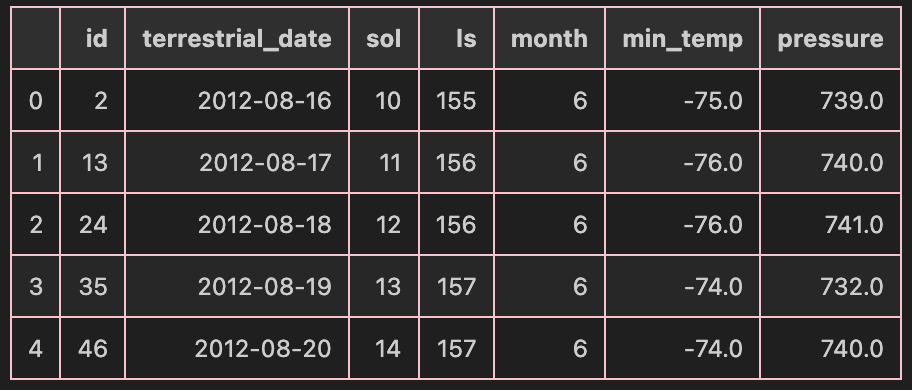

# Mars Scraping and Data Analysis Project

## Background

In this project, I applied web scraping and data analysis techniques to collect, organize, and analyze data from Mars-related websites. The goal was to strengthen skills in data collection, organization, analysis, and visualization. I used tools such as Splinter and Beautiful Soup for scraping web data and Pandas for data analysis.

## What I Created

This project consists of two main deliverables:

### Deliverable 1: Scrape Titles and Preview Text from Mars News Articles

1. **Jupyter Notebook**: `part_1_mars_news.ipynb`
2. **Steps Taken**:
   - Used automated browsing with Splinter to access the Mars news website.
   - Inspected the HTML elements to identify the relevant data for scraping.
``` browser = Browser('chrome')
# Visit the website
# https://static.bc-edx.com/data/web/mars_facts/temperature.html
url = "https://static.bc-edx.com/data/web/mars_facts/temperature.html"
browser.visit(url)
```
   - Created a Beautiful Soup object to parse the HTML and extract news article titles and preview text.
```
html = browser.html
soup = BeautifulSoup(html, 'html.parser')
```
   - Stored each title-and-preview pair in a Python dictionary and collected all dictionaries in a list.
   - Printed the list in the notebook.
   - Optionally exported the data to a JSON file for ease of sharing.

---
Output of data:
```
{'title': "NASA's MAVEN Observes Martian Light Show Caused by Major Solar Storm", 'preview': 'For the first time in its eight years orbiting Mars, NASA’s MAVEN mission witnessed two different types of ultraviolet aurorae simultaneously, the result of solar storms that began on Aug. 27.'}
{'title': "NASA Prepares to Say 'Farewell' to InSight Spacecraft", 'preview': 'A closer look at what goes into wrapping up the mission as the spacecraft’s power supply continues to dwindle.'}
{'title': 'NASA and ESA Agree on Next Steps to Return Mars Samples to Earth', 'preview': 'The agency’s Perseverance rover will establish the first sample depot on Mars.'}
{'title': "NASA's InSight Lander Detects Stunning Meteoroid Impact on Mars", 'preview': 'The agency’s lander felt the ground shake during the impact while cameras aboard the Mars Reconnaissance Orbiter spotted the yawning new crater from space.'}
```
---

### Deliverable 2: Scrape and Analyze Mars Weather Data

1. **Jupyter Notebook**: `part_2_mars_weather.ipynb`
2. **Steps Taken**:
   - Used automated browsing with Splinter to visit the Mars Temperature Data site.
   - Created a Beautiful Soup object to scrape data from the HTML table.
   - Assembled the scraped data into a Pandas DataFrame with columns matching the table
```
['2', '2012-08-16', '10', '155', '6', '-75.0', '739.0']
['13', '2012-08-17', '11', '156', '6', '-76.0', '740.0']
['24', '2012-08-18', '12', '156', '6', '-76.0', '741.0']
['35', '2012-08-19', '13', '157', '6', '-74.0', '732.0']
['46', '2012-08-20', '14', '157', '6', '-74.0', '740.0']
['57', '2012-08-21', '15', '158', '6', '-78.0', '740.0']
```

headings:
   - `id`: Identification number of a transmission from the Curiosity rover
   - `terrestrial_date`: Date on Earth
   - `sol`: Number of elapsed sols (Martian days)
   - `ls`: Solar longitude
   - `month`: Martian month
   - `min_temp`: Minimum temperature (Celsius) of a Martian day
   - `pressure`: Atmospheric pressure at Curiosity's location
    

   - Examined and converted data types as needed.
   - Analyzed the dataset to answer the following questions:
     1. **Number of Martian Months**: Calculated the number of distinct Martian months.
     2. **Total Martian Days**: Counted the total number of Martian days in the dataset.
     3. **Coldest and Warmest Months**:
        - Calculated average minimum daily temperatures for each month.
        - Plotted the results as a bar chart.
       
```
#Average Low Temperature by Month
1    -77.160920
2    -79.932584
3    -83.307292
4    -82.747423
5    -79.308725
6    -75.299320
7    -72.281690
8    -68.382979
9    -69.171642
10   -71.982143
11   -71.985507
12   -74.451807
# The coldest month on Mars is month 3 with an average minimum temperature of -83.31°C.
# The warmest month on Mars is month 8 with an average minimum temperature of -68.38°C.
```
       

     4. **Months with Lowest and Highest Pressure**:
        - Calculated average daily atmospheric pressure for each month.
        - Plotted the results as a bar chart.

     5. **Martian Year Duration**:
        - Estimated the number of terrestrial days in a Martian year by analyzing the daily minimum temperature plot.

```
# To find the wave line of best fit and find the average time between waves:
from numpy.polynomial.polynomial import Polynomial
from scipy.optimize import curve_fit
import numpy as np

def sinusoidal(x, A, B, C, D):
    return A * np.sin(B * x + C) + D

params, params_covariance = curve_fit(sinusoidal, df['sol'], df['min_temp'], p0=[10, 0.01, 0, -70])

x_fit = np.linspace(df['sol'].min(), df['sol'].max(), 500)
y_fit = sinusoidal(x_fit, *params)

B = params[1]
period = 2 * np.pi / B
x_max = x_fit.max()
for i in np.arange(0, x_max, period):
    plt.axvline(x=i, color='gray', linestyle='--', linewidth=0.5)
line_positions = np.arange(0, x_max, period)

plt.plot(df['sol'], df['min_temp'], color='plum')
plt.plot(x_fit, y_fit, label='Fitted Wave Function', color='deeppink')  
plt.xlabel('Sol (Martian Days)')
plt.ylabel('Minimum Temperature (°C)')
plt.title('Daily Minimum Temperature Over Time on Mars')
plt.legend()
plt.show()

# Finding average number of days
for pos in line_positions:
    print(f"{pos:.2f}")

print(f"\nDistance between each wave (Period): {period:.2f}")

# 0.00, 669.08, 1338.15
# Distance between each wave (Period): 669.08
```
   - Exported the DataFrame to a CSV file for further use.

## Files

- **`part_1_mars_news.ipynb`**: Jupyter notebook for scraping Mars news titles and previews.
- **`part_2_mars_weather.ipynb`**: Jupyter notebook for scraping and analyzing Mars weather data.
- **`mars_data.csv`**: CSV file containing the scraped Mars weather data (exported).

## Tools and Libraries Used

- **Splinter**: For automated browsing and interaction with web pages.
- **Beautiful Soup**: For parsing HTML and extracting data.
- **Pandas**: For data analysis and manipulation.
- **Matplotlib**: For plotting charts and visualizing data.

```
from splinter import Browser
from bs4 import BeautifulSoup
import matplotlib.pyplot as plt
import pandas as pd
```

---

This README provides a clear overview of what was accomplished in the project, including details on the process and deliverables.
